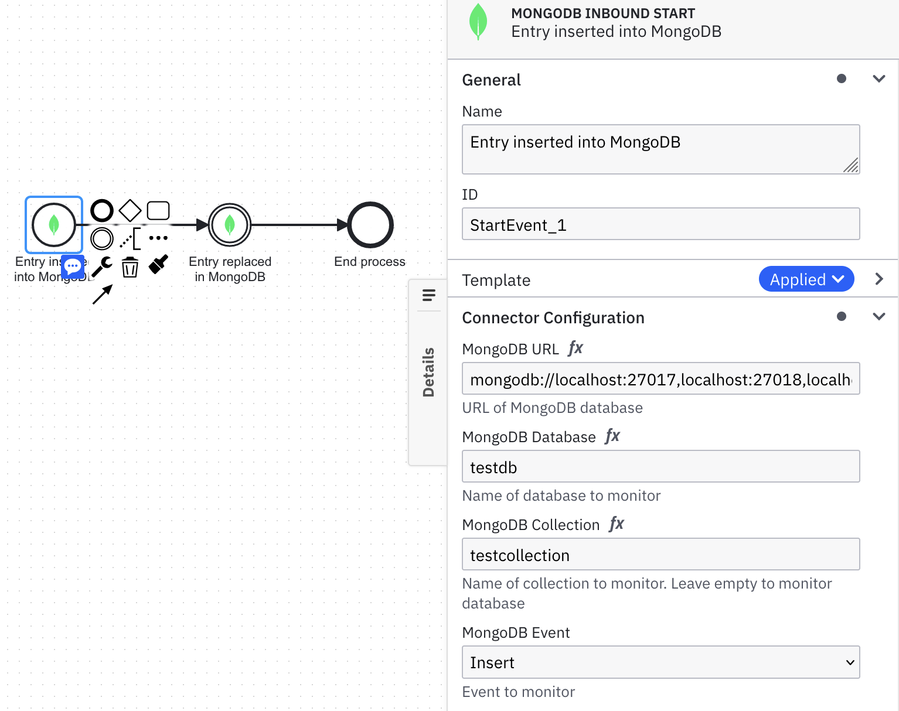
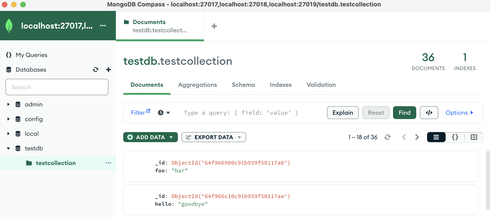

[](https://github.com/camunda-community-hub/community)
[](https://github.com/Camunda-Community-Hub/community/blob/main/extension-lifecycle.md#proof-of-concept-)


# Inbound MongoDB Connector Template

!!! Work in progress !!!

A starting point to build a Start and Intermediate Inbound Postgres Connector. Use the Change Stream feature in MongoDB to start process instances or throw intermediate events. Feedback and PRs are welcome! In the Connector you'll need to provide the Mongo DB URL (using a Replica Set or Sharded Cluster topology), database name , optional collection name, and type of event (or all) to monitor.

If you are unfamiliar with how to set up a MongoDB Replica Set, follow these [instructions](./MongoDBSampleSetup.md) to set one up locally. 

Output can be accessed from the ```event``` object

```event.operationType```

```event.before```

```event.after```

An example of a MongoDB start event:



A screenshot of MongoDB Compass connected to a replica set:



For intermediate catch events you need to set a correlation key in the process using a variable and send the correlation key in the payload as part of the incoming message

## Build

You can package the Connector by running the following command:

```bash
mvn clean package
```

This will create the following artifacts:

- A thin JAR without dependencies.
- An uber JAR containing all dependencies, potentially shaded to avoid classpath conflicts. This will not include the SDK artifacts since those are in scope `provided` and will be brought along by the respective Connector Runtime executing the Connector.

### Shading dependencies

You can use the `maven-shade-plugin` defined in the [Maven configuration](./pom.xml) to relocate common dependencies
that are used in other Connectors and the [Connector Runtime](https://github.com/camunda-community-hub/spring-zeebe/tree/master/connector-runtime#building-connector-runtime-bundles).
This helps to avoid classpath conflicts when the Connector is executed.

Use the `relocations` configuration in the Maven Shade plugin to define the dependencies that should be shaded.
The [Maven Shade documentation](https://maven.apache.org/plugins/maven-shade-plugin/examples/class-relocation.html)
provides more details on relocations.

## API

### Connector Properties

This Connector can be configured with the following properties:

| Name               | Description                                                     | Example                                                                     | Required |
|--------------------|-----------------------------------------------------------------|-----------------------------------------------------------------------------|----------|
| MongoDB URL        | URL of MongoDB Server using a Replica Set or Clustered topology | `mongodb://localhost:27017,localhost:27018,localhost:27019/?replicaSet=rs0` | Yes      |
| MongoDB Database   | Name of database to monitor                                     | `testdb`                                                                    | Yes      |
| MongoDB Collection | Name of collection to monitor                                   | `testcollection`                                                            | No       |
| MongoDB Event      | Name of event to monitor - Insert, Replace, Delete, Any         | `any`                                                                       | No       |

### Output

This Connector produces the following output:

```json
{  
  "event": {
    "operationType":"insert",
    "before":"{}",  
    "after": {
      "hello":"world",
      "_id": {
        "date": "Fri Sep 08 18:03:35 BST 2023",
        "timestamp": 1694192615
      }
    }
  }
}
```

## Test locally

Run unit tests

```bash
mvn clean verify
```

### Test with local runtime

Use the [Camunda Connector Runtime](https://github.com/camunda-community-hub/spring-zeebe/tree/master/connector-runtime#building-connector-runtime-bundles) to run your function as a local Java application.

In your IDE you can also simply navigate to the `LocalContainerRuntime` class in test scope and run it via your IDE.
If necessary, you can adjust `application.properties` in test scope.

## Element Template

The element templates can be found in the element-templates directory.
